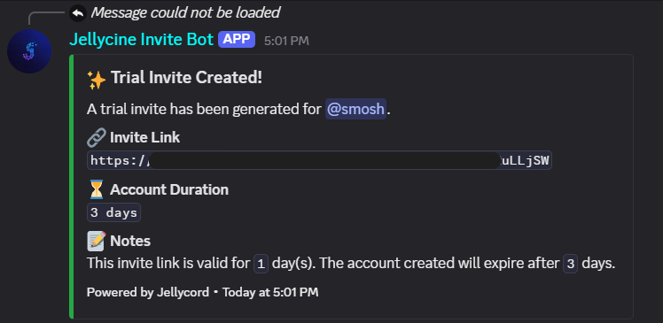
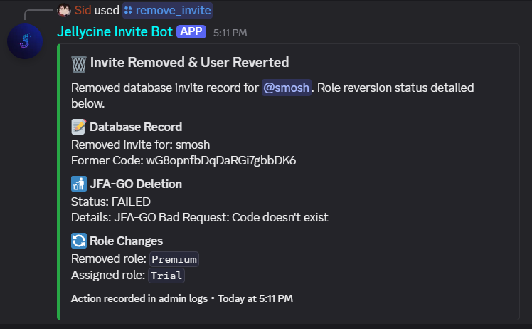
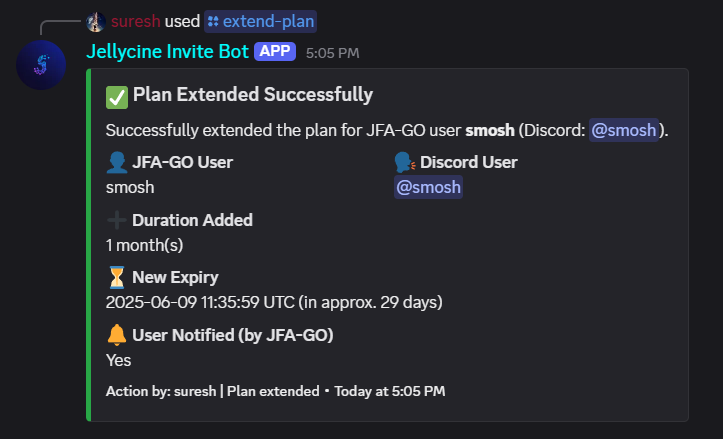

<p align="center">
  
</p>

# Jellycord: A JFA-GO Companion Bot

[](https://github.com/Rapptz/discord.py)
[](https://www.python.org/)
[](https://hub.docker.com/r/sidikulous/jellycord)

## Description

Jellycord is a highly configurable Discord bot designed as a companion app to integrate with [JFA-GO](https://github.com/hrfee/jfa-go) for managing user invites to a Jellyfin media server. It empowers authorized Discord users to create trial and paid invite links, manage existing invites, and extend user plans directly within designated support channels or threads. All bot behaviors, settings, messages, and embed appearances are customizable through YAML and JSON configuration files.

**Important Note / Current Limitations:**
*   Jellycord currently does **not** support migrating existing users from your JFA-GO database to the bot's database.
*   Jellycord is best suited for new JFA-GO setups or if this limitation is not a major hurdle for your existing workflow.

## Features

*   **Configurable Invite Types:**
    *   **Trial Invites:** Create temporary, single-use trial invites. Durations for the invite link and the resulting user account are configurable.
    *   **Paid Invites:** Generate invites linked to specific JFA-GO user profiles, with customizable account durations.
*   **Enhanced Invite Management:**
    *   `/remove_invite [user_identifier]`: Identifies a user by Discord mention/ID or Jellyfin username. Attempts to delete the user from JFA-GO, delete their associated JFA-GO invite code, and sets their invite status to 'disabled' in Jellycord's local database. It also attempts to revert their Discord roles.
    *   Extend the expiry of existing JFA-GO user accounts.
*   **User Notifications:** Automatically notify users via DM before their JFA-GO account expires, with configurable notification timings.
*   **Role-Based Access Control:** Restrict command usage to users with specific Discord roles within designated support categories/channels.
*   **Comprehensive Admin Logging:** Logs administrative actions (invite creation/removal, plan extensions) to a specified Discord channel and the local database. All log messages are configurable.
*   **Deep JFA-GO Integration:** Communicates directly with the JFA-GO API for profile fetching, user lookup, invite creation/deletion, and plan extensions.
*   **Database Persistence:** Stores invite information and admin actions in an SQLite database (filename configurable).
*   **Fully Configurable Messaging:** All user-facing messages, embed titles, field names, colors, and footers are configurable via a `message_templates.json` file.
*   **Centralized YAML Configuration:** Primary bot settings (name, branding), JFA-GO connection details, Discord server specifics (IDs, roles, channels), command behaviors, and role mappings are managed through a central `config.yaml` file.
*   **Modular Design:** Code is structured into modules for better organization and maintainability.
*   **Docker Support:** Includes a Dockerfile for easy containerization and deployment.

## Tech Stack

*   **Language:** Python 3.12+
*   **Discord API Wrapper:** [discord.py](https://github.com/Rapptz/discord.py)
*   **HTTP Requests:** [requests](https://requests.readthedocs.io/en/latest/)
*   **Configuration:** [PyYAML](https://pyyaml.org/) for `config.yaml`, [python-dotenv](https://github.com/theskumar/python-dotenv) for `.env` (secrets/overrides).
*   **Database:** SQLite 3
*   **JFA-GO:** Interacts with a running JFA-GO instance API.

## Prerequisites

*   Python 3.12 or higher
*   `pip` (Python package installer)
*   A running instance of [JFA-GO](https://github.com/hrfee/jfa-go) accessible from where the bot runs.
*   A Discord Bot Token and Application.
*   [Docker](https://www.docker.com/) (Optional, for containerized deployment)

## Setup and Installation

1.  **Clone the repository:**
    ```bash
    git clone <your-repository-url> # Replace with the actual URL
    cd Jellycord # Or your chosen directory name
    ```

2.  **Navigate to the source directory:**
    This project now uses a `src` directory for its main codebase.
    ```bash
    cd src # Or your chosen directory name if you cloned into a subdirectory
    ```

3.  **Create a virtual environment (Recommended, from within the `src` directory or project root):**
    If you are in the project root:
    ```bash
    python -m venv .venv
    # Activate the virtual environment
    # Windows (Command Prompt/PowerShell)
    .venv\Scripts\activate
    # Linux/macOS
    source .venv/bin/activate
    ```
    If you `cd src` first, adjust paths accordingly or create venv in root.

4.  **Install dependencies (from the project root where `requirements.txt` is):**
    ```bash
    pip install -r requirements.txt
    ```

5.  **Configure the Bot:**

    *   **Configuration Directory:** All configuration files now reside in the `config/` directory in the project root.
    *   **Example Files:**
        Copy `config/config.yaml.example` to `config/config.yaml`.
        Copy `config/message_templates.json.example` to `config/message_templates.json`.

    *   **Primary Configuration (`config/config.yaml`):**
        Edit `config/config.yaml`. Detailed comments within `config/config.yaml.example` explain each option.

    *   **Secrets & Environment-Specific Overrides (`.env` file):**
        Create a `.env` file in the project root.
        Place critical secrets like `DISCORD_TOKEN`, `JFA_GO_USERNAME`, and `JFA_GO_PASSWORD` in `.env`.

    *   **Message Customization (`config/message_templates.json`):**
        Edit `config/message_templates.json` to change any bot output. The path is set in `config/config.yaml` (`message_settings.templates_file`, which should default to or be set to `config/message_templates.json`).

## Running the Bot

### Directly with Python

Ensure your virtual environment is activated and `config/config.yaml` (and `.env` in the project root) are configured.
Run from the project root:
```bash
python src/main.py
```

### Using Docker

Deploying Jellycord with Docker is a convenient way to manage the application and its dependencies. You can use a pre-built image from Docker Hub or build the image locally.

**Recommended: Using the Pre-built Docker Image from Docker Hub**

A pre-built image is available on Docker Hub: [sidikulous/jellycord:latest](https://hub.docker.com/repository/docker/sidikulous/jellycord).

1.  **Prepare your host environment:**
    *   Create a dedicated directory for your Jellycord configuration and data. For example:
        ```bash
        mkdir ~/jellycord_bot_data
        cd ~/jellycord_bot_data
        ```
    *   Inside this directory, create subdirectories for the database and logs if you plan to map them from the host:
        ```bash
        mkdir my_bot_db
        mkdir my_bot_logs
        ```
        Ensure these directories have the correct permissions for the Docker user/group to write to them.
    *   Place your `config.yaml` and `.env` file (containing secrets) in the `~/jellycord_bot_data` directory. Create a `config` subdirectory within `~/jellycord_bot_data` and place your `config.yaml` and `message_templates.json` there.
        ```bash
        # Example structure in ~/jellycord_bot_data
        # .
        # |-- .env
        # |-- config/
        # |   |-- config.yaml
        # |   `-- message_templates.json (if customized)
        # |-- my_bot_db/
        # `-- my_bot_logs/
        ```

2.  **Configure Paths in `config.yaml` (inside `~/jellycord_bot_data/config/config.yaml`):**
    Update your `config.yaml` to reflect the paths *inside the container*.
    The Docker run command below mounts:
    * Host `~/jellycord_bot_data/config/config.yaml` to Container `/app/config/config.yaml`
    * Host `~/jellycord_bot_data/config/message_templates.json` to Container `/app/config/message_templates.json`
    * Host `~/jellycord_bot_data/my_bot_db` to Container `/app/data/db`
    * Host `~/jellycord_bot_data/my_bot_logs` to Container `/app/logs`

    Therefore, your `config.yaml` (the one on your host at `~/jellycord_bot_data/config/config.yaml`) should use these *container-relative* paths:
    ```yaml
    bot_settings:
      # ... other bot_settings ...
      db_file_name: "data/db/jellycord.db"      # Path inside the container
      log_file_name: "logs/jellycord.log"       # Path inside the container
      # ...
    message_settings:
      templates_file: "config/message_templates.json" # Path inside the container
      # ...
    ```

3.  **Run the Docker container:**
    From your dedicated directory (`~/jellycord_bot_data` in this example), run the following command:
    ```bash
    docker run -d \
      --name jellycord \
      --env-file .env \
      -v "$(pwd)/config/config.yaml:/app/config/config.yaml:ro" \
      -v "$(pwd)/config/message_templates.json:/app/config/message_templates.json:ro" \
      -v "$(pwd)/my_bot_db:/app/data/db" \
      -v "$(pwd)/my_bot_logs:/app/logs" \
      sidikulous/jellycord:latest
    ```
    *   `--env-file .env`: Passes your secrets from `~/jellycord_bot_data/.env` to the container.
    *   `-v "$(pwd)/config/config.yaml:/app/config/config.yaml:ro"`: Mounts your host `config.yaml`.
    *   `-v "$(pwd)/config/message_templates.json:/app/config/message_templates.json:ro"`: Mounts your host `message_templates.json`.
    *   `-v "$(pwd)/my_bot_db:/app/data/db"`: Mounts your host database directory.
    *   `-v "$(pwd)/my_bot_logs:/app/logs"`: Mounts your host logs directory.
    *   `-d`: Runs the container in detached mode.
    *   `sidikulous/jellycord:latest`: Specifies the image to use.

**Alternative: Building the Docker image locally**

1.  **Build the Docker image:**
    From the root of the project directory (where the `Dockerfile` is located):
    ```bash
    docker build -t jellycord-bot .
    ```

2.  **Run the Docker container (using local build):**
    Follow the same steps 1 and 2 from the "Pre-built Image" section to prepare your host environment and configure `config.yaml`. Then, run the container using your locally built image name:
    ```bash
    # Ensure you are in your dedicated directory (e.g., ~/jellycord_bot_data)
    docker run -d \
      --name jellycord \
      --env-file .env \
      -v "$(pwd)/config/config.yaml:/app/config/config.yaml:ro" \
      -v "$(pwd)/config/message_templates.json:/app/config/message_templates.json:ro" \
      -v "$(pwd)/my_bot_db:/app/data/db" \
      -v "$(pwd)/my_bot_logs:/app/logs" \
      jellycord-bot # Use your local image name
    ```

**Common Docker Operations:**

*   To view logs:
    ```bash
    docker logs jellycord -f
    ```
*   To stop the container:
    ```bash
    docker stop jellycord
    ```
*   To remove the container (after stopping):
    ```bash
    docker rm jellycord
    ```

**Updating the Bot (Docker):**

To update Jellycord to the latest version when using a pre-built Docker image:

1.  **Pull the latest image from Docker Hub:**
    ```bash
    docker pull sidikulous/jellycord:latest
    ```
2.  **Stop the currently running container:**
    ```bash
    docker stop jellycord
    ```
3.  **Remove the old container:**
    This does *not* delete your data volumes.
    ```bash
    docker rm jellycord
    ```
4.  **Run the new container using the same `docker run` command as before.** Ensure your volume mounts (`-v`) for `config.yaml`, `message_templates.json` (if used), `bot_data_db`, and `bot_data_logs` are identical to your initial setup. This will reconnect the new container to your existing data and configuration.

    Navigate to your dedicated bot directory (e.g., `~/jellycord_bot_data`) and execute:
    ```bash
    docker run -d \
      --name jellycord \
      --env-file .env \
      -v "$(pwd)/config/config.yaml:/app/config/config.yaml:ro" \
      -v "$(pwd)/config/message_templates.json:/app/config/message_templates.json:ro" \
      -v "$(pwd)/my_bot_db:/app/data/db" \
      -v "$(pwd)/my_bot_logs:/app/logs" \
      sidikulous/jellycord:latest
    ```
    Your existing database and logs will be used by the updated bot.

    *   Ensure the `db_file_name` (`data/db/your_database.db`), `log_file_name` (`logs/your_log.log`), and `templates_file` (`config/message_templates.json`) paths in your host's `config/config.yaml` correctly point to locations that align with the container's perspective, as configured by the volume mounts.

## Configuration Explained

Configuration is primarily managed via `config/config.yaml`. Environment variables can override these settings. Refer to `config/config.yaml.example` for a comprehensive list of options.

Key sections in `config/config.yaml`:

*   **`bot_settings`**: General bot settings (name, log file, database file, debug mode).
*   **`discord`**: Discord-specific settings (token, guild ID, admin log channel, authorized roles/channels for commands, role for trial users, notification channel and timings).
*   **`jfa_go`**: JFA-GO connection details (base URL, username, password - ideally set in `.env`, default trial profile).
*   **`invite_settings`**: Global settings for invite generation (base URL for invite links, default link validity, trial account duration, label formats for trial/paid invites, JFA-GO profile to Discord role mapping for paid invites).
*   **`message_settings`**: Path to `config/message_templates.json`, default embed colors, default embed footer text (can use `{bot_name}` placeholder), and the bot's display name used in messages.
*   **`notification_settings`**: Configuration for user expiry notifications (how far ahead to check for expiries, how often to send the same notification, and on which specific days before expiry to notify).
*   **`commands`**: Fine-grained settings for specific commands:
    *   `create_trial_invite`: Override JFA-GO user expiry, label format, and assigned Discord role for trial invites.
    *   `create_user_invite`: Override invite link validity, define the mapping from JFA-GO plans to Discord roles, and specify the trial role to remove when a user plan is given.
    *   `/remove_invite [user_identifier]`: Identifies a user by Discord mention/ID or Jellyfin username. Attempts to delete the user from JFA-GO, delete their associated JFA-GO invite code, and sets their invite status to 'disabled' in Jellycord's local database. It also attempts to revert their Discord roles.
    *   `/extend-plan [user] [jfa_username] [months/days/hours/minutes (at least one required)] [reason (optional)] [notify (optional)]`: Extends a user's JFA-GO plan.

## Module Breakdown

The project is structured with a `src/` directory containing the core application code.

*   **`src/main.py`**: Entry point; initializes logging, configuration, the bot instance, registers handlers, and runs the bot.
*   **`src/modules/config.py`**: Loads and validates configuration from `config/config.yaml` and environment variables.
*   **`src/modules/logging_setup.py`**: Configures application-wide logging (output to `logs/`).
*   **`src/modules/messaging.py`**: Loads `config/message_templates.json` and provides message/embed helpers.
*   **`src/modules/models.py`**: Defines data classes.
*   **`src/modules/database.py`**: Manages SQLite database interactions (database stored in `data/db/`).
*   **`src/modules/jfa_client.py`**: Handles all communication with the JFA-GO API.
*   **`src/modules/bot.py`**: Defines the main `JfaGoBot` class, event handling, command tree, and background tasks.
*   **`src/modules/commands/`**: Sub-package for command definitions.
    *   `auth.py`: Authorization decorators.
    *   `invite_commands.py`: Logic for `/create-trial-invite`.
    *   `user_invite_commands.py`: Logic for `/create-user-invite`.
    *   `admin_commands.py`: Logic for `/remove_invite` and `/extend-plan`.

## Usage

Once the bot is running and configured:

1.  Invite the bot to your Discord server.
2.  Ensure commands are usable in channels/categories listed in `discord.command_channel_ids`.
3.  Ensure users who need to run commands have a role listed in `discord.command_authorized_roles`.
4.  Available slash commands (exact behavior and output are configurable):
    *   `/create-trial-invite`: Creates a trial invite for a user in the current channel/thread (user is auto-detected).
        <p align="center">
          
        </p>
    *   `/create-user-invite [user] [plan_type] [months (optional)] [days (optional)]`: Creates a user invite for a specified Discord user, assigning them to a JFA-GO plan.
        <p align="center">
          
        </p>
    *   `/remove_invite [user_identifier]`: Identifies a user by Discord mention/ID or Jellyfin username. Attempts to delete the user from JFA-GO, delete their associated JFA-GO invite code, and sets their invite status to 'disabled' in Jellycord's local database. It also attempts to revert their Discord roles.
        <p align="center">
          
        </p>
    *   `/extend-plan [user] [jfa_username] [months/days/hours/minutes (at least one required)] [reason (optional)] [notify (optional)]`: Extends a user's JFA-GO plan.
        <p align="center">
          
        </p>

## Contributing

Contributions, issues, and feature requests are welcome!

## License

This project is licensed under the GNU License. See the `LICENSE` file for details.
